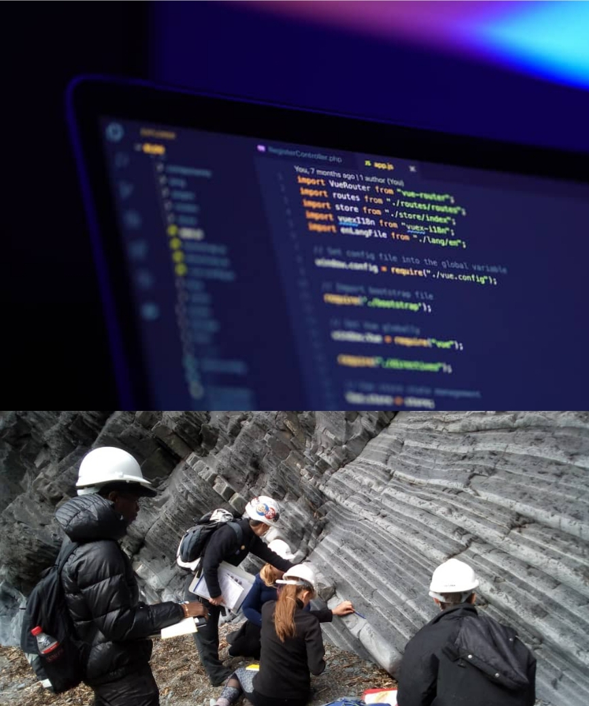

I never thought I would end up as a programmer. As a geology major in university, I was passionate about understanding the natural world around me. I loved analyzing rock formations and identifying different types of strata. But during my second year, I was surprised to find that I had a mandatory introductory course in computer science. At first, I was skeptical, but as I started learning about Object-Oriented Programming (OOP) in Java and other coding concepts, I found myself captivated.

However, my experience with programming in university was far from ideal. The lack of resources in the class meant that my understanding of Java remained largely theoretical. I struggled to make sense of how the knowledge I had acquired would apply to the real world, and eventually grew resentful towards programming. It wasn't until after graduation, when I discovered Codecademy and other online learning resources, that I realized my problem wasn't with programming itself - it was the way it had been taught to me.

As I delved deeper into the world of coding, I began to see connections between programming and geology. I realized that many of the same principles applied to both fields, particularly when it came to data structures. Rocks can exist as interconnected networks of fragile and robustly connected strata, and similarly, a database can utilize the same strategies of data organization and storage. This realization only deepened my fascination with coding.

Learning to code has really helped me get a better handle on math - it's way easier to focus on the concepts instead of getting bogged down in calculations. Plus, you can create your own shortcuts to solve problems and skip the boring stuff.In my experience, everything in industry is all about statistics. Instead of relying on one guess, we try to account for all possible outcomes and make decisions based on that. With coding, that's a piece of cake.
But the real kicker is that before you start, you don't even know what kind of cool ideas and solutions you'll come up with. Once you have coding skills, you've got a whole new set of tools in your arsenal and you'll start seeing all sorts of problems you can solve.

Looking back, I sometimes wonder if I made the right decision in pursuing geology instead of computer science. But I know that the journey has only just begun, and the best is yet to come. With my newfound understanding of the connections between geology and programming, I feel more confident than ever before that I can make a valuable contribution to the tech industry.